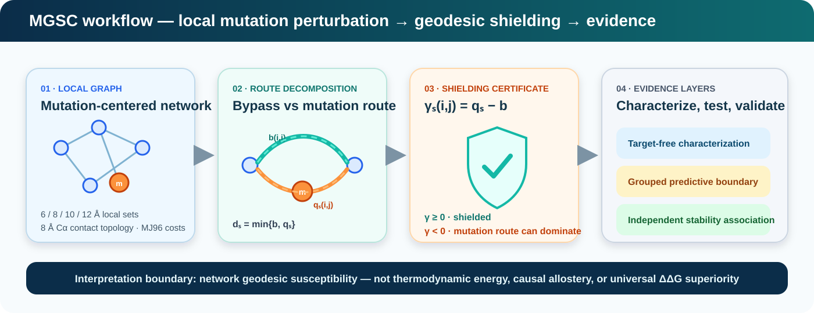

<p align="center">
  
</p>

<h1 align="center">Mutation Geodesic Shielding for Protein Stability</h1>

<p align="center">
  <strong>Public reproducibility companion for the MGSC protein-stability study</strong>
</p>

<p align="center">
  <a href="https://github.com/SunilgarGusai/mutation-geodesic-shielding-protein-stability/actions/workflows/repository-validation.yml"></a>
  <a href="requirements.txt"></a>
  <a href="CITATION.cff"></a>
  <a href="LICENSE"></a>
  
</p>

<p align="center">
  <a href="#study-at-a-glance">Study</a> •
  <a href="#mgsc-at-a-glance">MGSC</a> •
  <a href="#reproducibility">Reproducibility</a> •
  <a href="#reviewer-map">Reviewer map</a> •
  <a href="#citation">Citation</a>
</p>

---

## Study at a glance

A single amino-acid substitution changes local chemistry, but alternative network routes may keep the surrounding shortest-path geometry unchanged. The **Mutation Geodesic Shielding Certificate (MGSC)** makes that distinction explicit in mutation-centered, chemically weighted residue networks.

> **Question:** when is a mutation-site perturbation geodesically exposed to the local residue network, and when is it shielded by an existing bypass?

The study is organized around three separated evidence layers: **target-free characterization**, **independent stability association**, and an **explicit-mutant structural comparison** with a prespecified testability boundary. The primary predictive added-value result is retained even though it does not support robust improvement over the direct structural/chemical baseline.

## MGSC at a glance

<p align="center">
  
</p>

<p align="center">
  <sub>Animation is decorative. <a href="docs/assets/mgsc-workflow.svg">Open the static SVG</a>.</sub>
</p>

MGSC separates two routes for an off-mutation residue pair: a **bypass** after removing the mutation node and a **through-mutation** route constrained to traverse it. Their difference defines the shielding margin used for pair classification and site-level susceptibility.

For the exact equations and fixed-topology assumptions, see [`docs/METHOD_PROTOCOL.md`](docs/METHOD_PROTOCOL.md).

## Evidence snapshot

| Evidence layer | Frozen outcome |
|---|---|
| Target-free development | **382,543 substitutions**; zero MGSC/direct-silence mismatches |
| Whole-mutation shielding | **38.544%** across the prespecified local radii |
| Protected added-information test | primary interval crosses zero — **predictive increment not supported** |
| Independent external analysis | site-level association supported; adjusted independence not supported |
| Explicit-mutant structures | descriptive agreement; confirmatory inference **inconclusive** |

Detailed estimates, intervals, cohort counts, and interpretation boundaries are kept in [`docs/FROZEN_RESULTS.md`](docs/FROZEN_RESULTS.md).

## Reproducibility

This repository is an **auditable public artifact**, not a mirror of the private journal-submission package. It includes the reference implementation, automated tests, frozen aggregate CSV results, provenance records, environment files, claim boundaries, and quantitative-figure regeneration utilities.

```bash
conda env create -f environment.yml
conda activate mgsc-protein-stability

python scripts/validate_public_artifact.py
pytest -q
python scripts/generate_quantitative_figures.py
```

The same reviewer-facing checks run automatically in GitHub Actions.

> The submitted manuscript PDF/source, Supporting Information, cover letter, and journal-portal files are intentionally excluded from the public repository during peer review.

## Reviewer map

| Need | Start here |
|---|---|
| Exact construction | [`docs/METHOD_PROTOCOL.md`](docs/METHOD_PROTOCOL.md) |
| Headline frozen evidence | [`docs/FROZEN_RESULTS.md`](docs/FROZEN_RESULTS.md) |
| Claim-to-file inventory | [`REPOSITORY_MANIFEST.csv`](REPOSITORY_MANIFEST.csv) |
| Reference implementation | [`src/mgsc.py`](src/mgsc.py) |
| Chemical path-cost transform | [`src/graph_costs.py`](src/graph_costs.py) |
| Tests and invariants | [`tests/`](tests/) and [`scripts/validate_public_artifact.py`](scripts/validate_public_artifact.py) |
| Data lineage | [`docs/DATA_PROVENANCE.md`](docs/DATA_PROVENANCE.md) |
| Scientific claim limits | [`docs/CLAIM_BOUNDARIES.md`](docs/CLAIM_BOUNDARIES.md) |

<details>
<summary><b>Scientific interpretation boundary</b></summary>

MGSC is a mutation-conditioned **graph-geodesic susceptibility** framework. It is not a thermodynamic energy, a causal allostery model, or evidence of universal superiority over established ΔΔG predictors. Exact certificate agreement verifies the stated fixed-topology construction; it is not independent biological validation. The adjusted external result and the underpowered structural confirmatory analysis remain visible by design.

</details>

<details>
<summary><b>Repository structure</b></summary>

```text
.
├── .github/workflows/     automated verification
├── docs/                  method, evidence, provenance, claim boundaries
│   └── assets/            scientific SVG visuals
├── results/               frozen machine-readable aggregate results
├── scripts/               validation + figure regeneration
├── src/                   MGSC reference implementation
├── tests/                 exact-decomposition tests
├── environment.yml
├── requirements.txt
├── QUICKSTART.md
├── REPOSITORY_MANIFEST.csv
└── CITATION.cff
```

</details>

## Authors

**Sunilgar L. Gusai** — corresponding author, Department of Computer Applications, Marwadi University  
ORCID: [0009-0004-0739-4812](https://orcid.org/0009-0004-0739-4812) · [dr.sunilgargusai@gmail.com](mailto:dr.sunilgargusai@gmail.com)

**Manoharsinh R. Jadeja** — Department of Artificial Intelligence, Machine Learning and Data Science, Marwadi University  
ORCID: [0000-0003-1833-4730](https://orcid.org/0000-0003-1833-4730)

## Citation

Citation metadata are provided in [`CITATION.cff`](CITATION.cff). Please cite the associated article when final bibliographic metadata become available.

## License

Original project code is released under the [`MIT License`](LICENSE). Third-party datasets, structures, statistical potentials, publications, and software retain their original terms; see [`THIRD_PARTY_LICENSES.md`](THIRD_PARTY_LICENSES.md).
