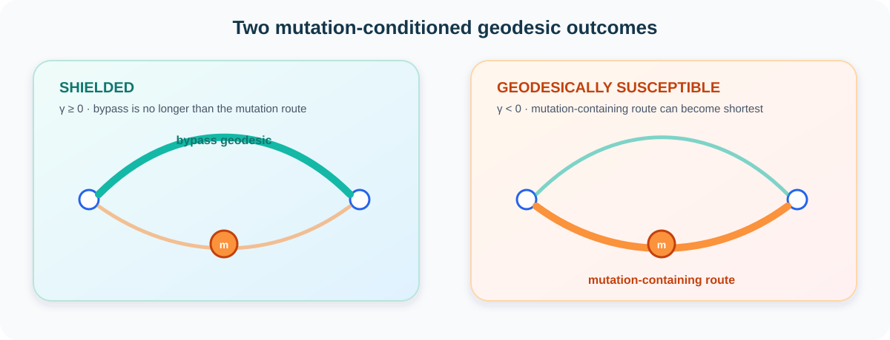

<p align="center">
  
</p>

<h1 align="center">Mutation Geodesic Shielding for Protein Stability</h1>

<p align="center">
  <strong>Reproducibility repository for</strong><br/>
  <strong>Mutation Geodesic Shielding Characterizes Residue-Network Susceptibility in Protein Stability</strong>
</p>

<p align="center">
  <a href="https://github.com/SunilgarGusai/mutation-geodesic-shielding-protein-stability/actions/workflows/repository-validation.yml"></a>
  <a href="requirements.txt"></a>
  <a href="docs/FROZEN_RESULTS.md"></a>
  <a href="docs/FROZEN_RESULTS.md"></a>
  <a href="CITATION.cff"></a>
  <a href="LICENSE"></a>
  
</p>

<p align="center">
  <a href="#why-this-study">Why this study?</a> •
  <a href="#method-at-a-glance">Method</a> •
  <a href="#study-design">Study design</a> •
  <a href="#key-evidence">Key evidence</a> •
  <a href="#reproducibility">Reproducibility</a> •
  <a href="#result-to-source-map">Result map</a> •
  <a href="#citation">Citation</a>
</p>

---

## Why this study?

A single amino-acid substitution can change local residue chemistry without necessarily changing the shortest-path organization of the surrounding residue network. Alternative routes may bypass the mutated residue and **shield** off-site geodesics from that local perturbation.

This repository accompanies the **Mutation Geodesic Shielding Certificate (MGSC)** study, which separates mutation-bypassing and mutation-containing routes in local chemically weighted residue-interaction graphs.

> **Central question:** When does a mutation-site perturbation remain locally contained because alternative geodesics bypass the mutated residue, and when can the mutation-conditioned route become network-relevant?

MGSC is an **interpretable residue-network susceptibility framework**. It is not a thermodynamic energy, not a causal model of allostery, and not presented as a universally superior stand-alone ΔΔG predictor.

The study deliberately retains negative and inconclusive evidence:

- the primary nonlinear added-information test does **not** establish robust predictive improvement beyond a direct local structural/chemical baseline;
- the external site-level association is strongly attenuated after adjustment for burial, packing, and direct local chemistry;
- the explicit-mutant structural analysis remains **descriptive**, because only 5 mixed structural clusters were available versus the prespecified minimum of 8.

These boundaries are part of the result, not exceptions hidden from it.

<p align="center">
  
</p>

## Method at a glance

For mutation node \(m\), remove \(m\) to obtain the bypass graph \(H=G-m\). For an off-mutation pair \(i,j\),

\[
b(i,j)=d_H(i,j)
\]

is the best mutation-bypassing distance. For state \(S\),

\[
q_S(i,j)=\min_{u\neq v\in N(m)}
\left[d_H(i,u)+w_S(u,m)+w_S(m,v)+d_H(v,j)\right]
\]

is the best route constrained to traverse the mutation node. The fixed-topology decomposition is

\[
d_S(i,j)=\min\{b(i,j),q_S(i,j)\},
\qquad
\gamma_S(i,j)=q_S(i,j)-b(i,j).
\]

- \(\gamma_S\ge 0\): an equally short or shorter bypass exists — **shielded**.
- \(\gamma_S<0\): the best mutation-containing route can dominate — **geodesically susceptible**.

<p align="center">
  
</p>

<p align="center"><sub>Animated path highlighting is decorative; the scientific workflow is unchanged. <a href="docs/assets/mgsc-workflow.svg">Open the static high-resolution SVG</a>.</sub></p>

The expensive bypass structure can be reused across the 19 possible substitutions at one residue site because the fixed-topology virtual model changes only mutation-incident edge costs. The study uses this mutation-conditioned saturation view to define site-level geodesic susceptibility.

See [`docs/METHOD_PROTOCOL.md`](docs/METHOD_PROTOCOL.md) for the exact public method specification.

## Study design

| Evidence block | Frozen scope | Scientific role |
|---|---:|---|
| Development cohort | **382,543 mutations** · 408 parents · 154 homology groups | Target-free MGSC verification and shielding characterization |
| Protected development cohort | **345,085 mutations** · 370 parents · 129 homology groups | Grouped added-information test beyond direct structural/chemical features |
| Independent external cohort | **2,600 mapped mutations** · 88 parents | Frozen experimental stability analysis |
| External H1 analysis | **1,245 sites** · 61 proteins · 52 homology groups | Site-level GEO_SUSC association |
| External H2 analysis | **103 mixed sites** | Same-site substitution contrast |
| Explicit-mutant structures | **342 direct variants** · 13 structural clusters | Virtual-versus-explicit structural credibility |
| Prespecified local radii | **6, 8, 10, 12 Å** | Multiscale local residue environments |

The contact topology uses an 8 Å Cα cutoff. Chemical shortest-path costs use the frozen MJ96-conditioned positive transform documented in [`docs/METHOD_PROTOCOL.md`](docs/METHOD_PROTOCOL.md).

## Key evidence

The public repository exposes manuscript-supporting aggregate outputs directly through machine-readable CSV files. The reviewer-facing summary is in [`docs/FROZEN_RESULTS.md`](docs/FROZEN_RESULTS.md).

| Evidence | Frozen result | Interpretation |
|---|---:|---|
| Exact target-free certificate check | **0 mismatches** across 382,543 mutations and all prespecified radii | Implementation/exact-decomposition verification, not biological validation |
| Whole-mutation geodesic shielding | **147,448 / 382,543 = 38.544%** | A substantial fraction of substitutions are geodesically silent in the fixed-topology model |
| Primary added-information test | ΔMAE **+0.00079 kcal/mol**, 95% CI **[-0.00027, +0.00170]** | Robust incremental nonlinear prediction is **not supported** |
| External site-level association (H1) | β **-1.01107**, 95% CI **[-1.37692, -0.61688]** | Greater site susceptibility is associated with lower / more destabilizing ΔΔG landscapes |
| Adjusted specificity analysis (S1) | β **-0.09236**, 95% CI **[-0.40795, +0.16936]** | No supported claim of independence from conventional local environment/chemistry |
| Same-site contrast (H2) | **+0.40151 kcal/mol**, 95% CI **[+0.27047, +0.74082]** | Propagation-positive substitutions have higher / less destabilizing ΔΔG than shielded substitutions at the same site |
| Explicit-mutant structural evidence | equal-cluster cosine **0.83845** | Descriptive only; confirmatory inference unavailable with 5 mixed clusters vs minimum 8 |

### A negative result worth keeping visible

MGSC is not presented as a rescued ΔΔG predictor. In the protected grouped evaluation, adding the compact shielding summaries to the direct structural/chemical baseline changed MAE from **0.573765** to **0.572973 kcal/mol**. The homology-group bootstrap interval for the improvement crossed zero. That negative primary result is retained explicitly.

Likewise, the external GEO_SUSC association becomes unsupported after adjustment for conventional local structural and chemical variables. The study therefore supports a **network-susceptibility association**, not a claim that MGSC supplies an independent thermodynamic axis.

## Reproducibility

This repository is designed as an **auditable reviewer-facing research artifact**, not as an unexplained code dump.

### Public content

The live branch contains:

- a compact reference implementation of the MGSC fixed-topology decomposition;
- chemical edge-cost utilities;
- target-free identity tests;
- machine-readable frozen aggregate results;
- method, provenance, literature, claim-boundary, and reproducibility documentation;
- deterministic quantitative-figure regeneration;
- repository-level validation through GitHub Actions;
- scientific SVG visuals for rapid reviewer orientation.

### What is intentionally not public during peer review

The submitted manuscript PDF/source, Supporting Information source/PDF, cover letter, and journal-portal files are **not stored in this public repository**. Large third-party structural archives and source datasets are also not mirrored unless redistribution rights are explicit.

### Environment

```bash
conda env create -f environment.yml
conda activate mgsc-protein-stability
```

or:

```bash
python -m venv .venv
python -m pip install --upgrade pip
python -m pip install -r requirements.txt
```

### Validate the public artifact

```bash
python scripts/validate_public_artifact.py
pytest -q
python scripts/generate_quantitative_figures.py
```

The **Repository verification** GitHub Actions workflow runs these checks on pushes and pull requests.

See [`QUICKSTART.md`](QUICKSTART.md) and [`docs/REPRODUCIBILITY.md`](docs/REPRODUCIBILITY.md).

## Result-to-source map

| Manuscript evidence | Machine-readable repository source |
|---|---|
| Development cohort and shielding prevalence | [`results/mgsc_characterization.csv`](results/mgsc_characterization.csv) |
| Protected grouped added-information comparison | [`results/predictive_added_value.csv`](results/predictive_added_value.csv) |
| Independent H1 / S1 / H2 estimates | [`results/external_validation.csv`](results/external_validation.csv) |
| Explicit-mutant structural summary | [`results/structural_credibility.csv`](results/structural_credibility.csv) |
| Radius-wise structural robustness | [`results/structural_radius_robustness.csv`](results/structural_radius_robustness.csv) |
| Structural cluster class counts | [`results/structural_cluster_class_counts.csv`](results/structural_cluster_class_counts.csv) |
| Parent-origin shielding prevalence | [`results/parent_origin_shielding_prevalence.csv`](results/parent_origin_shielding_prevalence.csv) |
| Claim interpretation boundaries | [`results/claim_register.csv`](results/claim_register.csv) |
| Full reviewer-facing result guide | [`docs/FROZEN_RESULTS.md`](docs/FROZEN_RESULTS.md) |

## Repository structure

```text
.
├── .github/workflows/             # automated repository verification
├── docs/
│   ├── assets/                    # repository banner and scientific SVGs
│   ├── METHOD_PROTOCOL.md         # exact public MGSC formulation
│   ├── FROZEN_RESULTS.md          # headline evidence + interpretation
│   ├── DATA_PROVENANCE.md         # source lineage and redistribution boundary
│   ├── REPRODUCIBILITY.md         # public/author-side reproducibility boundary
│   └── CLAIM_BOUNDARIES.md        # supported and unsupported claims
├── environment/                   # compact reference environment notes
├── figures/                       # generated quantitative figure outputs / notes
├── manuscript/                    # metadata only; submission files are excluded
├── results/                       # frozen machine-readable aggregate results
├── scripts/                       # validation and figure-regeneration utilities
├── src/                           # MGSC reference implementation
├── tests/                         # exact-decomposition tests
├── CITATION.cff
├── environment.yml
├── requirements.txt
├── QUICKSTART.md
└── REPOSITORY_MANIFEST.csv
```

The curated [`REPOSITORY_MANIFEST.csv`](REPOSITORY_MANIFEST.csv) explains the reviewer-facing role of each major artifact.

## Scientific scope and limitations

This repository supports a **mutation-conditioned residue-network methodology study**. It does not establish that geodesic routing is thermodynamic free energy, that graph-geodesic propagation is physical allostery, or that MGSC is universally superior to established ΔΔG predictors.

Important boundaries include:

- fixed topology in the virtual mutation model;
- residue-pair statistical potentials are used as graph-routing weights, not physical free-energy changes;
- target-free exact agreement verifies the implementation of an exact construction rather than independently validating biology;
- the primary added-prediction interval includes zero;
- the adjusted external site-level coefficient includes zero;
- same-site H2 remains observational and can still reflect substitution chemistry;
- the explicit-mutant structural analysis is underpowered for the prespecified confirmatory cluster criterion.

## Release status

**Current status: manuscript-submission reproducibility repository.**

The public repository is aligned to the frozen manuscript evidence while deliberately excluding the submitted manuscript package during peer review. Publication metadata and a DOI can be added to `CITATION.cff` after publication or archival release without changing the frozen numerical evidence.

## Authors

- **Sunilgar L. Gusai** — corresponding author, Department of Computer Applications, Marwadi University  
  ORCID: [0009-0004-0739-4812](https://orcid.org/0009-0004-0739-4812)  
  Email: [dr.sunilgargusai@gmail.com](mailto:dr.sunilgargusai@gmail.com)
- **Manoharsinh R. Jadeja** — Department of Artificial Intelligence, Machine Learning and Data Science, Marwadi University  
  ORCID: [0000-0003-1833-4730](https://orcid.org/0000-0003-1833-4730)

## Citation

Citation metadata are provided in [`CITATION.cff`](CITATION.cff).

If you use the MGSC formulation, reference implementation, or frozen research outputs, please cite the associated manuscript once bibliographic publication metadata are available.

## License and usage

Original code in this repository is released under the [`MIT License`](LICENSE). Third-party datasets, structures, residue potentials, and publications retain their original licenses and terms. See [`THIRD_PARTY_LICENSES.md`](THIRD_PARTY_LICENSES.md) and [`docs/DATA_PROVENANCE.md`](docs/DATA_PROVENANCE.md).
